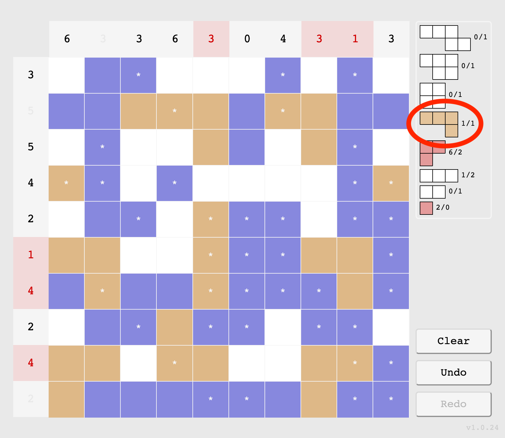

# Skärgården

## Goal of the game

The Swedish state has hired you to chart the archipelago. You contracted people to scout out all the islands, but they took off with the money leaving you with only loose clues as to where the islands are. Maybe you can somehow use these hints to finalize the sea charts?

## Quick tutorial

At the start of the game, you will be given a new chart. It will look like this:

Your objective is to colour in all the blank tiles, using the hints in the headers and the legend. A finished chart will look something like this:

Notice that each number in the headers match the number of land tiles in the respective row/column, and that each island shape in the legend is represented the correct number of times in the chart.

## Additional details

### Tiles

Tiles come in three types
- Land (Brown)
- Water (Blue)
- Blank (White)

Click the tiles to change their type. A white asterisk on a tile means that it was given as a hint, and that it cannot be changed.

#### Land tiles

Land tiles join together to form islands. An island is a set of land tiles that join together at the sides. Different islands must be completely separated by water, not even their corners can touch.

#### Water tiles

Water tiles separates the islands.

#### Blank tiles

Blank tiles indicate that you don't know yet whether the tile should be land or water. A finished chart can't have any blank tile.

### Headers

There are headers on the top and to the left of the chart. Each header contains the number of land tiles in its respective row or column. In this image, two headers are circled: 
- A column header with the number 0, indicating that the column contains 0 land tiles (i.e. only water)
- A row header with the number 4, indicating that the row contains 4 land tiles (and 6 water tiles).

#### Correct headers

If a row or column is correct with respect to the number indicated in its header, the header will be faded out. For example the circled column header and the circled row header are correctly filled with 3 and 5 land tiles respectively.

#### Incorrect headers

A red header indicates that the row or column contains too many land tiles or too many water tiles. Some of the current water tiles need to be land tiles or vice versa. For example the circled column header and the circled row header are incorrectly filled. The column contains too many land tiles, and the row contains too many water tiles.
, and one row header with too many water tiles (7 instead of 6)")

#### Auto fill

If the blank tiles in a row or column can be deduced to all be land tiles or all be water tiles by only looking at the number in the header, you can auto fill it by clicking the header.

### Island legend

The island legend helps you know the shape and number of islands you need to shart. Each entry in the legend has the form `<island_shape> current_count/correct_count`. Two islands are considered to have the same shape if they can be rotated to look the same. The shape in the legend does not necessarily have the same rotation as the island(s) in the chart. 

Here is the island legend circled in red.

#### Correct shapes

A brown shape in the legend indicates that you have the correct number of islands with that shape in your chart. For example, in this image the only correct shape (with 1 out of 1 found) is circled in red.

#### Incomplete shapes

A white shape in the legend indicates that you have too few islands with that shape in your chart. In this image there are 5 incomplete shapes circled in red. From top to bottom, the 4th incomplete shape has 1 island out of 2 founds, and the rest of the incomplete shapes have 0 out of 1 found.
