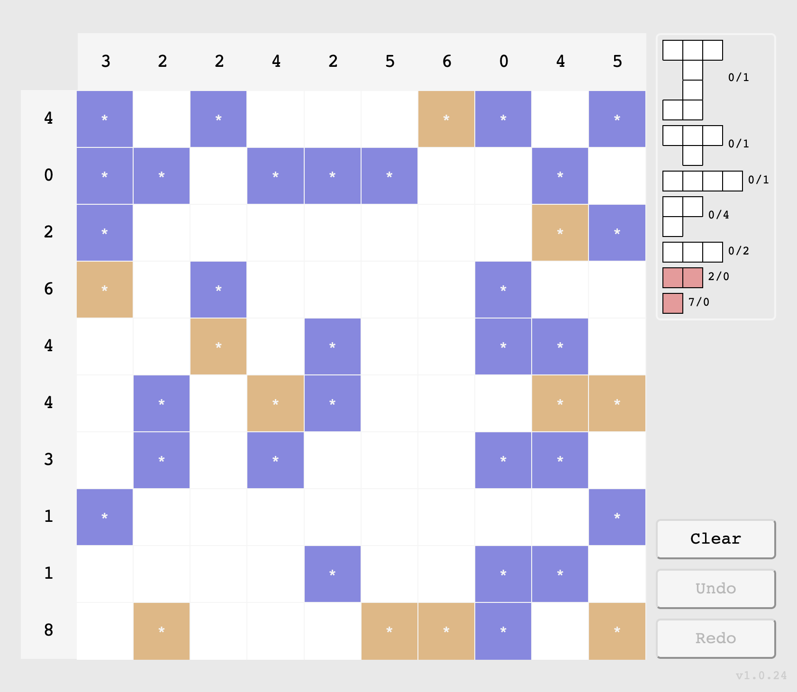
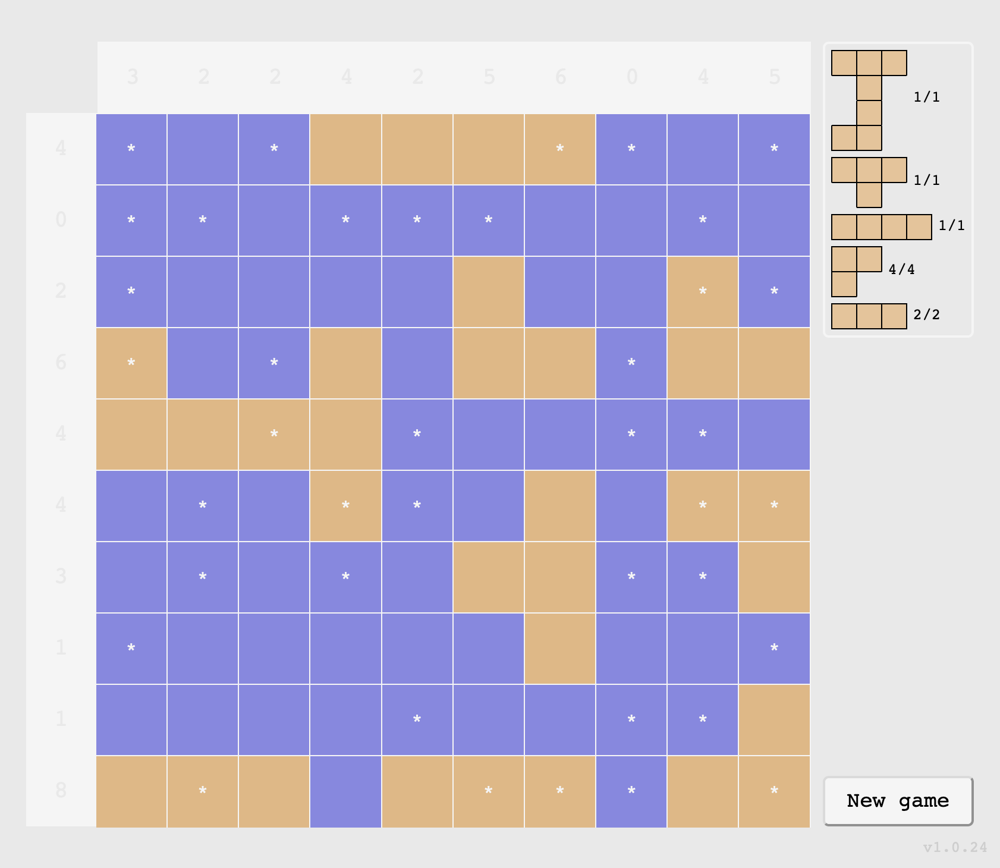
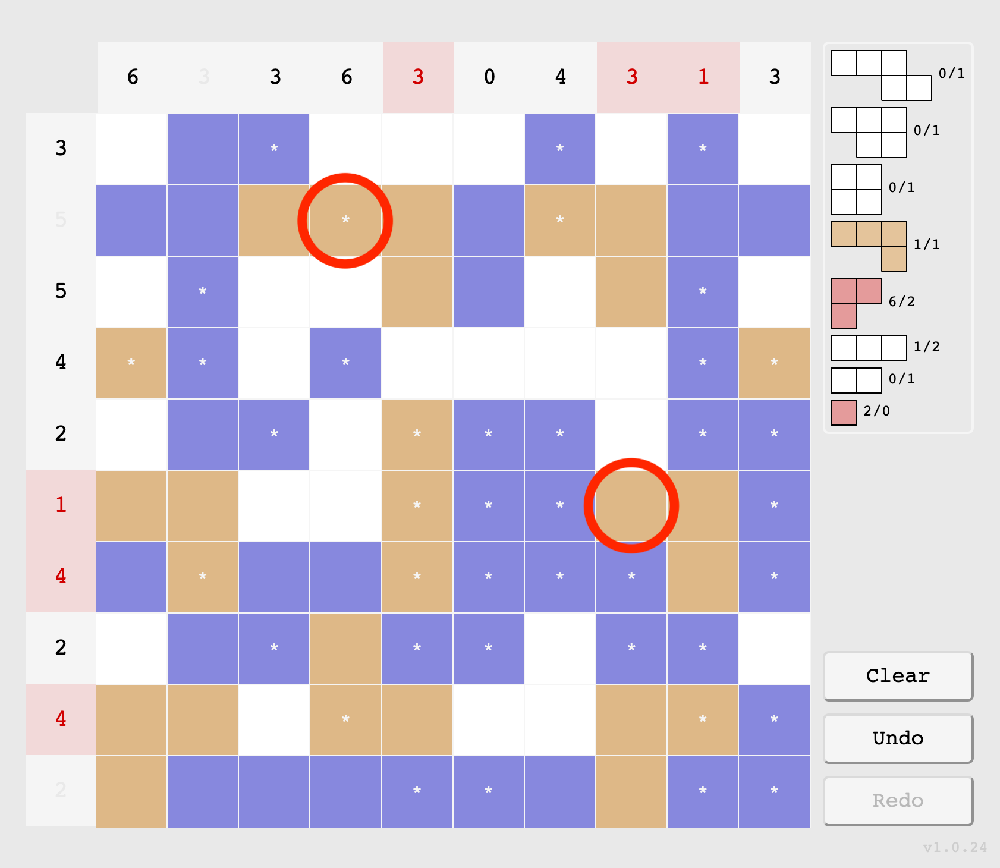
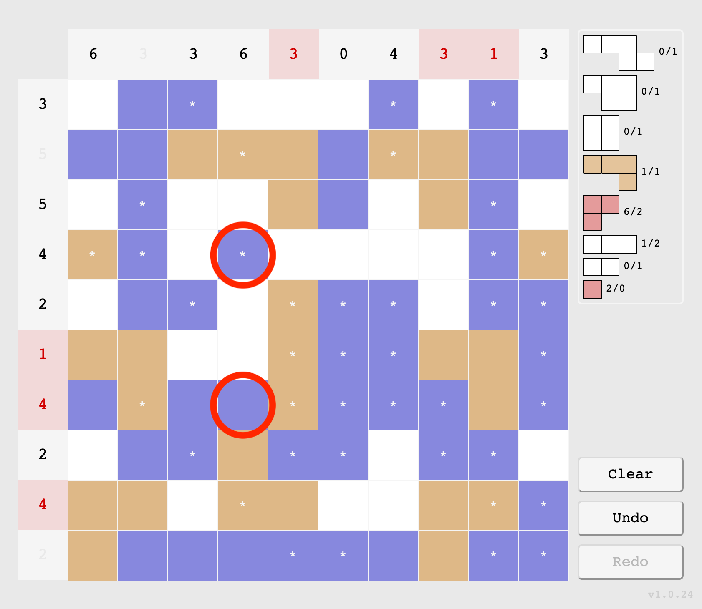
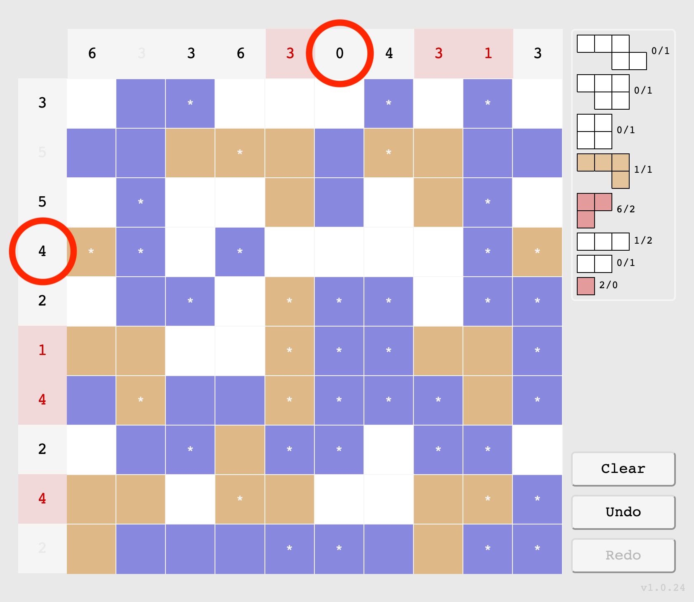

# Skärgården

## Goal of the game

The Swedish state has hired you to chart the archipelago. You contracted people to scout out all the islands, but they took off with the money leaving you with only loose clues as to where the islands are. Maybe you can somehow use these hints to finalize the sea charts?

## Quick tutorial

At the start of the game, you will be given a new chart. It will look like this:

Your objective is to colour in all the blank tiles, using the hints in the headers and the legend. A finished chart will look something like this:

Notice that each number in the headers match the number of land tiles in the respective row/column, and that each island shape in the legend is represented the correct number of times in the chart.

## Additional details

### Tiles

Tiles come in three types
- Land (Brown)
- Water (Blue)
- Blank (White)

Click the tiles to change their type. A white asterisk on a tile means that it was given as a hint, and that it cannot be changed.

#### Land tiles

Land tiles join together to form islands. An island is a set of land tiles that join together at the sides. Different islands must be completely separated by water, not even their corners can touch.

#### Water tiles

Water tiles separates the islands.

#### Blank tiles

Blank tiles indicate that you don't know yet whether the tile should be land or water. A finished chart can't have any blank tile.

### Headers

There are headers on the top and to the left of the chart. Each header contains the number of land tiles in its respective row or column. In this image, two headers are circled: 
- A column header with the number 0, indicating that the column contains 0 land tiles (i.e. only water)
- A row header with the number 4, indicating that the row contains 4 land tiles (and 6 water tiles).

### Legend